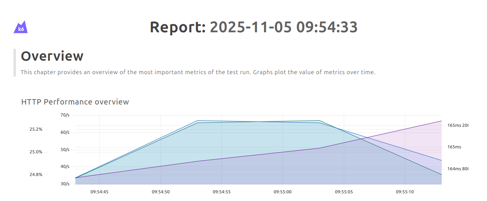

# K6 Stress Test POC

### Usage
```
docker compose up
```

### Output
```
█ THRESHOLDS 
 
    http_req_duration
    ✓ 'p(99.9)<800' p(99.9)=258.01ms
 
 
█ TOTAL RESULTS 
 
    checks_total.......: 3018    74.890291/s
    checks_succeeded...: 100.00% 3018 out of 3018
    checks_failed......: 0.00%   0 out of 3018

    ✓ Post done
    ✓ response time is acceptable
    ✓ Crocodiles loaded
    ✓ status is 403

    CUSTOM
    login_failures.................: 503    12.481715/s

    HTTP
    http_req_duration..............: avg=93.48ms  min=19.67ms med=103.82ms max=280.62ms p(90)=165.65ms p(95)=166.2ms
    { expected_response:true }...: avg=117.08ms min=20.65ms med=161.53ms max=280.62ms p(90)=165.9ms  p(95)=166.4ms
    http_req_failed................: 25.00% 503 out of 2012
    http_reqs......................: 2012   49.926861/s

    EXECUTION
    iteration_duration.............: avg=1.22s    min=1.2s    med=1.21s    max=2.75s    p(90)=1.21s    p(95)=1.21s  
    iterations.....................: 503    12.481715/s
    vus............................: 3      min=2           max=20
    vus_max........................: 20     min=20          max=20

    NETWORK
    data_received..................: 2.9 MB 73 kB/s
    data_sent......................: 185 kB 4.6 kB/s
```

### Check report
```
cp ./results/html-report.html ~/Downloads/
firefox ~/Downloads/html-report.html
```


### References

- https://www.baeldung.com/k6-framework-load-testing